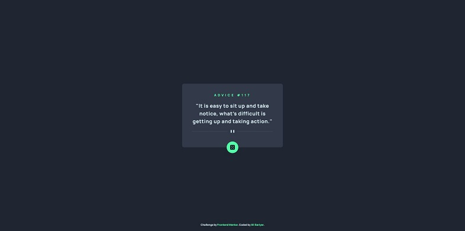

# Frontend Mentor - Advice generator app solution

This is a solution to the [Advice generator app challenge on Frontend Mentor](https://www.frontendmentor.io/challenges/advice-generator-app-QdUG-13db). Frontend Mentor challenges help you improve your coding skills by building realistic projects.

## Table of contents

- [Overview](#overview)
  - [The challenge](#the-challenge)
  - [Screenshot](#screenshot)
  - [Links](#links)
- [My process](#my-process)
  - [Built with](#built-with)
  - [What I learned](#what-i-learned)
- [Author](#author)

**Note: Delete this note and update the table of contents based on what sections you keep.**

## Overview

### The challenge

Users should be able to:

- View the optimal layout for the app depending on their device's screen size
- See hover states for all interactive elements on the page
- Generate a new piece of advice by clicking the dice icon

### Screenshot

### Links

- Solution URL: [Solution on GitHub](https://github.com/alisariyer/advice-generator)
- Live Site URL: [Live site on GitHub Pages](https://alisariyer.github.io/advice-generator)

## My process

### Built with

- Semantic HTML5 markup
- Sass main structure
- Sass define variables
- Sass main styling
- Sass compose mixins
- Flexbox
- Mobile-first workflow

### What I learned

In this project I learn change theme color in HTML by color theme:

`html
  <meta name="theme-color" media="(prefers-color-schema: light)" content="#cee3e9">
  <meta name="theme-color" media="(prefers-color-schema: dark)" content="#4e5d73">
`

## Author

- Website - [Ali Sariyer](https://alisariyer.github.io/alisariyer)
- Frontend Mentor - [@alisariyer](https://www.frontendmentor.io/profile/alisariyer)
- LinkedIn - [Ali Sariyer](https://www.linkedin.com/in/alisariyer)
- Twitter - [@sariyer_ali](https://www.twitter.com/sariyer_ali)

